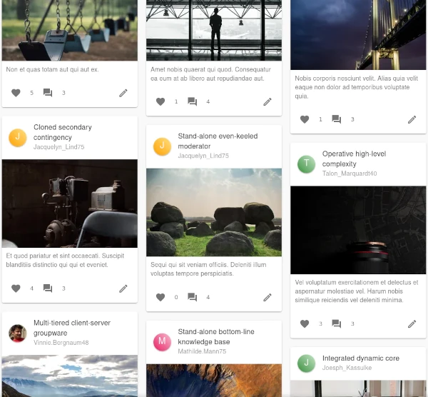

# Prismic Adventures



A mini-social network intended to share your adventures online!

## Features

- [X] Infinite scroll through posts; different views will show different set of posts.
- [X] Create posts and setup visibility and comment rules.
- [X] Like and comment on posts; author receives a notification immediately.
- [X] Upload post and profile images.
- [X] Authorization system where only admin users can view, comment, update and delete posts.
- [ ] Authorization system where users can designate other users to act as collaborators on their posts.
- [ ] Add coordinates of the location to create your own "have I been" map.
- [ ] Earth 3D visualization with all provided coordinates.
- [ ] Level up and gain badges as you accomplish goals by participating with the community.

## Test Credentials

If you don't want to signup you can use these credentials below to see how things work!

> Database is reset every few hours for consistency

```json
{
  "username": "luigi",
  "password": "iamluigi",
}
```
